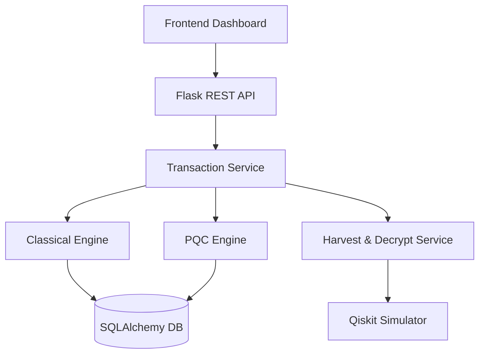

# Project Specifications: Quantum-Safe Banking Transaction PoC

## 1. Executive Summary
The **Quantum-Safe Banking Transaction PoC** is a state-of-the-art demonstration of transitioning financial systems from classical cryptographic standards to Post-Quantum Cryptography (PQC). As quantum computing advances, traditional algorithms like RSA and ECC are becoming vulnerable. This project provides a side-by-side comparison of **RSA-2048** and **ML-KEM-768 (Kyber)**, demonstrating both the performance benefits of lattice-based cryptography and the mitigations against "Harvest Now, Decrypt Later" (HNDL) attacks.

## 2. Technical Stack
The system is built using a modern, scalable, and research-oriented stack:

| Layer | Technology |
|---|---|
| **Backend** | Python 3.11+, Flask (RESTful Implementation) |
| **Database** | SQLite (SQLAlchemy ORM) |
| **Classical Crypto** | `cryptography` (Python) |
| **Post-Quantum Crypto** | `liboqs` (C-library) with `liboqs-python` bindings |
| **Quantum Simulation** | `Qiskit` (IBM Quantum SDK) |
| **Frontend** | HTML5, CSS3 (Vanilla), JavaScript, Chart.js |
| **Testing** | Pytest (Integration & Unit coverage) |

## 3. Cryptographic Specifications

### 3.1 Classical Suite (Baseline)
- **Asymmetric**: RSA-2048 (OAEP padding for encryption, PSS for signing).
- **Symmetric**: AES-256-GCM (used for bulk transaction encryption).
- **Hash**: SHA-256.

### 3.2 Post-Quantum Suite (Draft FIPS 203)
- **KEM (Key Encapsulation Mechanism)**: **ML-KEM-768** (FIPS 203 standard).
- **Hybrid Approach**: The system supports future-proofing by allowing PQC encapsulation to protect AES session keys.

### 3.3 Simulation Suite (Educational)
- **Shor's Algorithm Integration**: Using RSA-15 (simplified modulus) to demonstrate the mechanics of quantum factoring.

## 4. Technical Capabilities

### 4.1 Dual-Path Transaction Processing
The core engine executes every transaction simultaneously through both classical and quantum-safe pipelines. This allows for:
- **Zero-Latency Comparison**: Real-time evaluation of encryption and key generation overhead.
- **Protocol Transition Analysis**: Studying the increased payload size (ciphertext) of PQC vs classical.

### 4.2 Interactive Performance Dashboard
A real-time visualization layer that displays:
- **Latency Over Time**: Line charts showing millisecond-level precision for `keygen`, `encrypt`, and `decrypt`.
- **Payload Overhead**: Comparative bar charts for public key and ciphertext sizes.
- **Automated Stress Testing**: A built-in load generator to simulate high-traffic banking environments.

### 4.3 Harvest Now, Decrypt Later (HNDL) Simulation
A comprehensive visual walkthrough of a state-sponsored attack:
1. **The Harvest**: Intercepting and storing classical-encrypted data.
2. **The Leap**: A simulated "Time Skip" representing the progress toward Y2Q (Year-to-Quantum).
3. **The Decryption**: Executing Shor's algorithm on a quantum simulator to factor the modulus and recover PII (Personally Identifiable Information).

### 4.4 Advanced Benchmarking CLI
A standalone tool (`benchmark_cli.py`) that performs:
- **Statistical Profiling**: Min, Max, Avg, Median, and StDev calculations across 1000+ iterations.
- **Export Formats**: Automated generation of JSON and CSV reports for academic review.

## 5. System Architecture

The project follows a clean, modular architecture:

## 6. Security and Compliance Alignment
- **NIST PQC Standards**: Aligned with the latest NIST selections for Kyber (ML-KEM).
- **FIPS 203 Reference**: Implements parameters according to the draft FIPS 203 specifications.
- **Audit Trails**: Every simulated transaction is stored with detailed cryptographic metadata for post-mortem analysis.

---
**Prepared For**: Sarvatra Technologies / SPPU Final Year Project
**Status**: Production-Ready PoC
